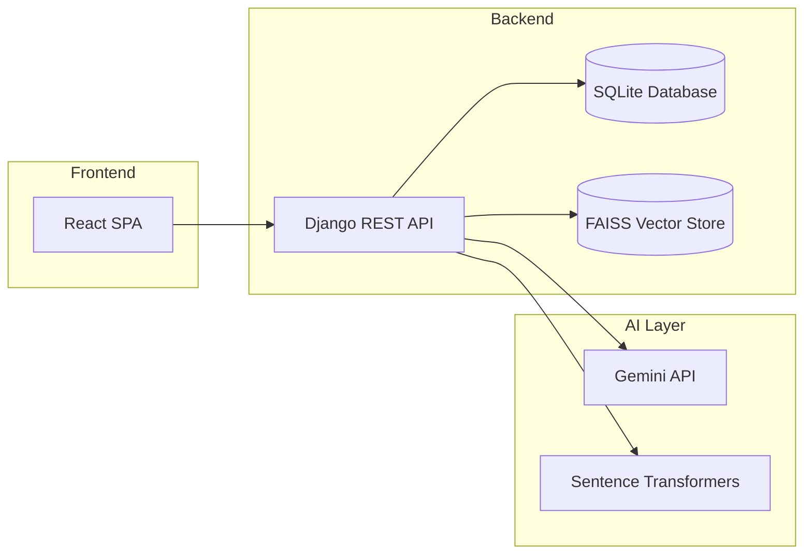

# IIPS Campus Placement Knowledge Hub

An AI-powered placement preparation platform designed specifically for students of the Institute of Information Technology & Management (IIPS). It serves as a centralized hub to browse past placement experiences, chat with an AI assistant grounded in real campus data, and prepare for HR rounds.

## 🌐 Live Demo

- **Link :** https://campus-placement-support.vercel.app/
## Features

- **AI Placement Assistant (RAG)**: Chat with a Gemini-powered AI that uses Retrieval-Augmented Generation to answer questions based on real, historical IIPS placement experiences. Includes a globally accessible Floating Action Button (FAB).
- **HR Prep Generator**: Automatically generate comprehensive HR interview briefs for specific companies, including company background, leadership, culture, and common questions.
- **Experience Browsing & Submission**: Students can share their interview experiences (rounds, CTC, tips) and browse others' experiences with rich filtering.
- **Admin Dashboard**: Manage placement statistics, bulk-upload experiences via Excel sheets, and view monthly selection trends.
- **Fully Responsive**: Mobile-first design that looks great on all devices, featuring a sleek, dark-themed modern UI.

## Tech Stack

### Frontend
- **React.js** (Vite)
- **React Router v6** for client-side routing
- **Context API** for authentication state management
- **Vanilla CSS** with CSS Modules and global variables for styling

### Backend
- **Django & Django REST Framework (DRF)**
- **Function-Based Views (FBV)** using `@api_view`
- **SQLite** database
- **JWT** for secure authentication (`djangorestframework-simplejwt`)
- **Pandas & OpenPyXL** for parsing Admin Excel uploads

### AI & Machine Learning
- **Google Gemini API** (`google-genai`) for LLM generation
- **FAISS (CPU)** for high-performance vector similarity search
- **Sentence Transformers** for generating text embeddings

## Architecture

### High-Level Workflow (RAG)
1. **Ingestion**: When a student or admin submits an experience, the backend chunks the text, embeds it using Sentence Transformers, and stores the vectors in FAISS.
2. **Retrieval**: When a student asks a question via the chat UI, the backend embeds the question, queries FAISS for the top-k most relevant chunks, and retrieves the matching text.
3. **Generation**: The backend sends a grounded prompt (System Prompt + Retrieved Context + User Question) to the Gemini API, which generates a precise, context-aware answer.

## Setup Instructions

### Backend Setup
1. Navigate to the `backend` directory.
2. Create a virtual environment: `python -m venv venv`
3. Activate it: `venv\Scripts\activate` (Windows) or `source venv/bin/activate` (Mac/Linux)
4. Install dependencies: `pip install -r requirements.txt`
5. Create a `.env` file based on `.env.example` and add your `GEMINI_API_KEY`.
6. Run migrations: `python manage.py migrate`
7. Start the server: `python manage.py runserver`

### Frontend Setup
1. Navigate to the `frontend` directory.
2. Install dependencies: `npm install`
3. Start the Vite dev server: `npm run dev`

## Developed by- 
- Geetanshi jain .
